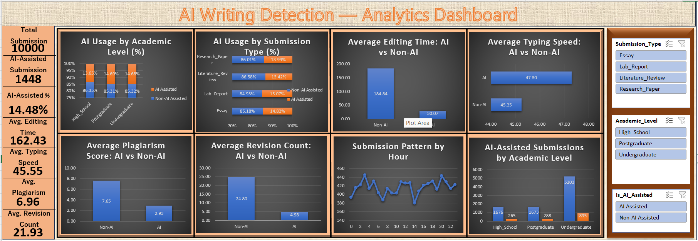

# AI Writing Detection Analysis

## 📊 Dashboard Preview

## 📌 Project Overview

This project analyzes academic writing data to identify patterns and differences between AI-assisted and non-AI-assisted submissions using Microsoft Excel.

The analysis focuses on writing characteristics, academic levels, submission types, editing behavior, typing speed, plagiarism score, revision count, and submission patterns.

## 🛠️ Tools & Technologies

- Microsoft Excel
- Pivot Tables
- Pivot Charts
- Data Cleaning
- Data Analysis
- Dashboard
- Slicers
- Conditional Formatting

## 📊 Dataset

- Total Records: 10,000
- Raw Dataset Records: 10,200
- Source: Kaggle
- Dataset: AI vs Human Academic Writing Dataset

## 🔍 Key Analysis Areas

- AI Usage by Academic Level
- AI Usage by Submission Type
- Average Editing Time: AI vs Non-AI
- Average Typing Speed: AI vs Non-AI
- Average Plagiarism Score
- Average Revision Count
- Submission Pattern by Hour
- AI-Assisted Submissions by Academic Level

## 📈 Key Metrics

| Metric | Non-AI | AI |
|---|---:|---:|
| Submissions | 8,552 | 1,448 |
| Average Editing Time | 184.84 | 30.07 |
| Average Typing Speed | 45.25 | 47.30 |
| Average Plagiarism Score | 7.65 | 2.93 |
| Average Revision Count | 24.80 | 4.98 |

## 📁 Excel Workbook Structure

- `ai_writing_detection_dataset` – Raw dataset
- `Link` – Dataset source
- `Main Table` – Main working dataset
- `Cleaned Data` – Cleaned dataset
- `Analysis` – Pivot-based analysis and KPIs
- `Dashboard` – Dashboard visualization

## 🎯 Project Objective

The objective of this project is to use Excel-based data analysis techniques to explore academic writing patterns and compare AI-assisted and non-AI-assisted submissions.

## 👨‍💻 Author

**Vedant Parate**

Data Analytics Learning Journey
