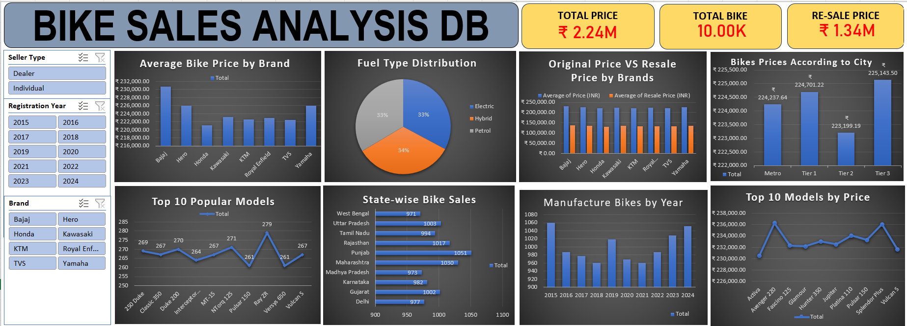

# 🏍️ Indian Bike Sales Dashboard

<p align="center">

  <strong>Interactive Excel Dashboard for Indian Bike Sales Analysis</strong>

  <br><br>

  

</p>

---

## 📊 Project Overview

The **Indian Bike Sales Dashboard** is an interactive data analytics project developed using **Microsoft Excel**.

The project transforms raw bike sales data into an interactive and visually engaging dashboard that helps analyze sales performance, brand performance, model performance, trends, and other important business metrics.

The dashboard is designed to make data exploration simple through **Dynamic KPIs, Pivot Tables, Charts, Slicers, and Interactive Filters**.

---

## 🎯 Problem Statement

Raw sales data can contain a large amount of information, making it difficult to quickly identify important trends, top-performing brands, high-performing models, and overall sales performance.

The objective of this project is to transform raw Indian bike sales data into a **clear, interactive, and business-friendly dashboard** that enables users to explore the data and extract meaningful insights efficiently.

---

## 💼 Business Objective

The dashboard aims to help answer important business questions such as:

- Which bike brands perform the best?
- Which bike models generate the highest sales?
- How do sales change over time?
- Which categories contribute most to overall sales?
- Which products have comparatively lower performance?
- What trends and patterns can be identified from the sales data?
- How can interactive filtering improve sales analysis?

---

## 📌 Key Features

### 🔹 Interactive Dashboard

A centralized dashboard provides an easy-to-understand overview of the sales data.

### 🔹 Dynamic KPIs

Key Performance Indicators provide a quick summary of important business metrics.

### 🔹 Interactive Slicers

Slicers allow users to dynamically filter the dashboard and analyze specific segments.

### 🔹 Sales Trend Analysis

Charts help identify changes and patterns in sales over time.

### 🔹 Brand-wise Analysis

Compare sales performance across different bike brands.

### 🔹 Model-wise Analysis

Identify top-performing and lower-performing bike models.

### 🔹 Category Analysis

Analyze sales performance across different bike categories.

### 🔹 Data Visualization

Interactive charts convert complex data into easy-to-understand visual insights.

---

## 📈 Dashboard Analysis

The dashboard focuses on multiple analytical dimensions, including:

| Analysis Area | Purpose |
|---|---|
| Total Sales | Understand overall sales performance |
| Sales Trend | Identify changes over time |
| Brand Performance | Compare different bike brands |
| Model Performance | Identify top-performing models |
| Category Analysis | Compare different categories |
| Top Performers | Identify high-performing products |
| Low Performers | Identify products with lower performance |
| KPI Analysis | Monitor important business metrics |

---

## 💡 Key Insights

The dashboard enables users to identify:

- Overall sales performance
- Best-performing bike brands
- Best-performing bike models
- Sales trends over time
- Category-level performance
- High and low-performing products
- Important patterns within the sales data

> **Note:** Specific numerical insights depend on the selected filters and dashboard view.

---

## 🛠️ Tools & Technologies

### Microsoft Excel

- Pivot Tables
- Pivot Charts
- Slicers
- Filters
- Excel Formulas
- Data Cleaning
- Data Analysis
- Data Visualization
- Dashboard Design

---

## 🔄 Data Analytics Process

The project follows a structured analytics workflow:

```text
Raw Data
   ↓
Data Cleaning
   ↓
Data Preparation
   ↓
Data Analysis
   ↓
Pivot Tables
   ↓
Pivot Charts
   ↓
Interactive Filters & Slicers
   ↓
Dynamic KPIs
   ↓
Interactive Dashboard
   ↓
Business Insights
